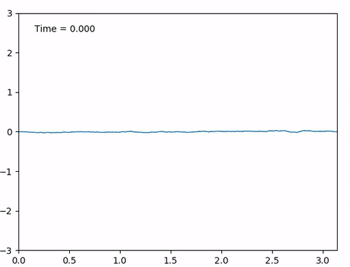

# Simulation of some SPDEs & related processes

- We use a Galerkin approximation to simulate the stochastic heat equation with
  additive noise:
  

  for space-time white noise :
  
  

- We simulate a sample path of a Brownian sheet:
  

- We simulate to solutions  to the KPZ equation (via the Cole-Hopf
  transform and an implicit finite difference scheme):
  

  for space time white noise  and two initial conditions 
  and we can observe that the solutions synchronize (see
  https://arxiv.org/abs/1907.06278):

  

- Finally, we simulate the ballistic deposition growth process (linked to a famous
  conjecture regarding the KPZ equation: https://arxiv.org/pdf/1106.1596.pdf):

  

