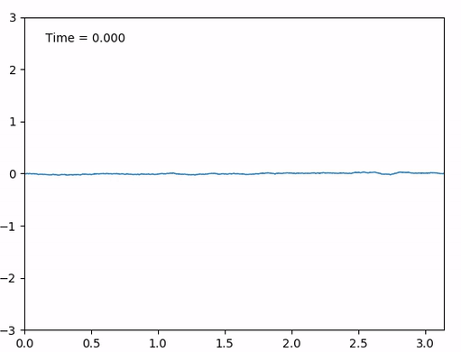
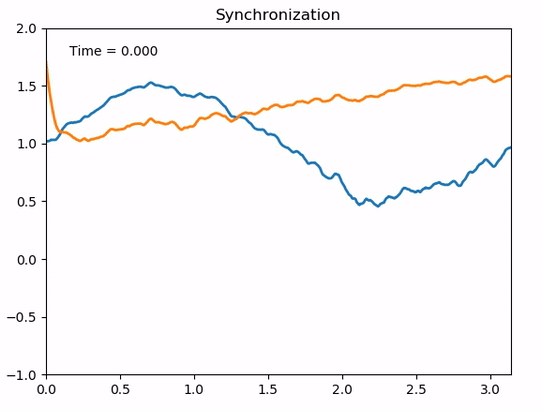

# Simulation of some SPDEs

- We use a Galerkin approximation to simulate the stochastic heat equation with
  additive noise:
  $$ \partial_t u = \Delta u + \xi $$
  for space-time white noise $\xi$:
  
  

- We simulate a sample path of a Brownian sheet:
  

- We simulate to solutions $h_1, h_2$ to the KPZ equation (via the Cole-Hopf
  transform and an implicit finite difference scheme):
  $$\partial_t h_i =\Delta h_i + (\partial_x h_i)^2 + \xi $$
  for space time white noise $\xi$ and two initial conditions $h_1(0), h_2(0)$
  and we can observe that the solutions synchronize (see
  https://arxiv.org/abs/1907.06278):

  

- Finally, we simulate the ballistic deposition growth process (linked to a famous
  conjecture regarding the KPZ equation: https://arxiv.org/pdf/1106.1596.pdf):

  

